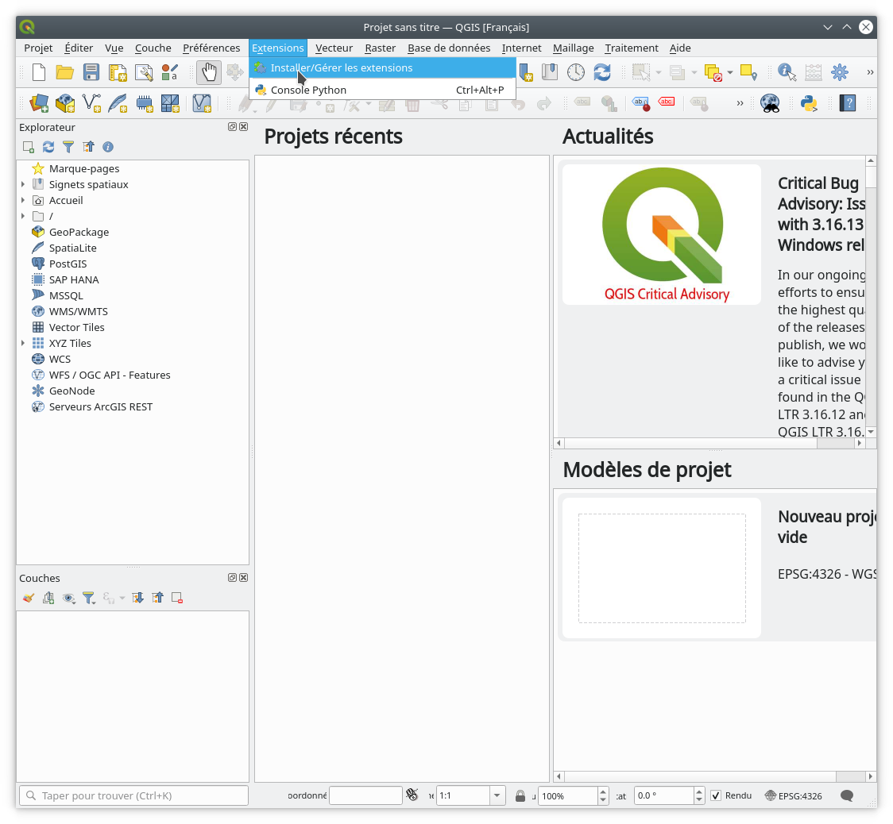
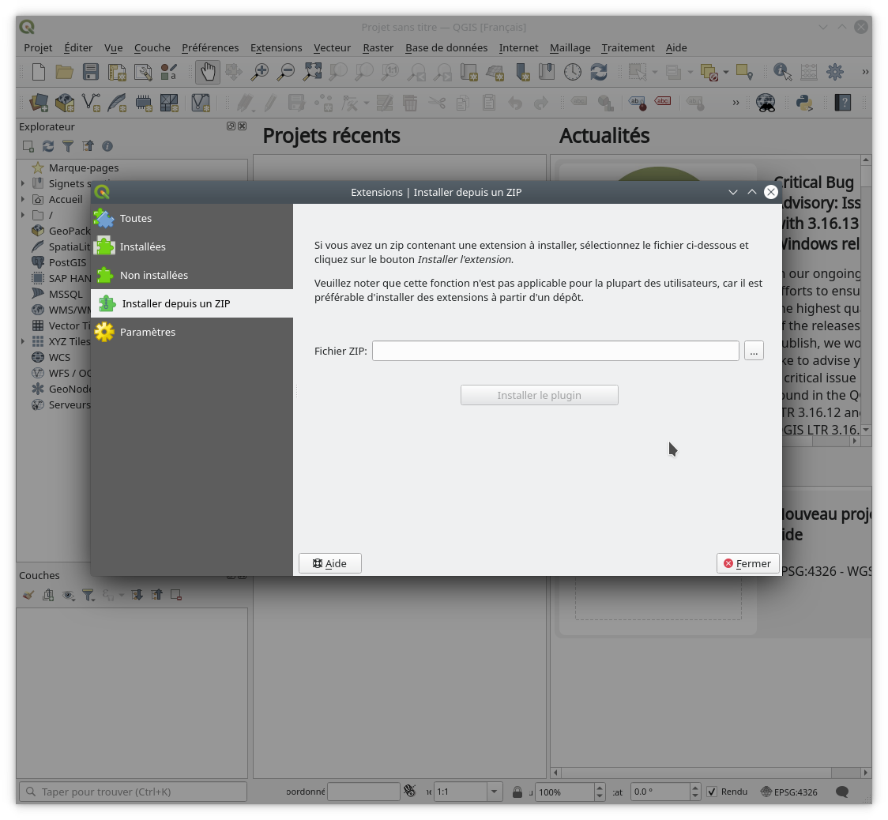

 
# Installation manuelle

Ouvrir la fenêtre des extensions :

Allez sur l'onglet "Installer depuis un zip" et sélectionnez le fichier AutoLayoutTool.zip

Acceptez d'installer l'extension

L'icone ci-dessous apparait ainsi qu'une nouvelle entrée dans le menu 'Extension'

